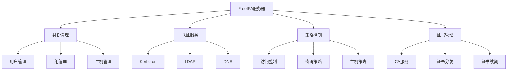
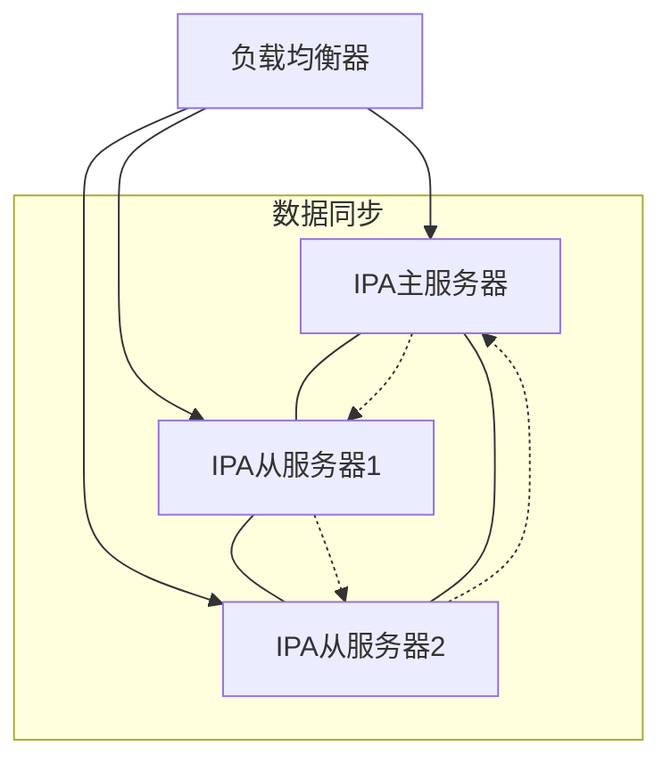

# FreeIPA 部署指南

> 版本: 2.0  
> 最后更新: 2024-01-17  
> 适用FreeIPA版本: 4.9.0+

## 目录

1. [系统准备](#系统准备)
2. [安装配置](#安装配置)
3. [验证部署](#验证部署)
4. [高可用部署](#高可用部署)
5. [运维管理](#运维管理)
6. [故障排除](#故障排除)
7. [最佳实践](#最佳实践)
8. [使用案例](#使用案例)
9. [集成指南](#集成指南)

## FreeIPA架构概述



FreeIPA是一个集成的安全信息管理解决方案，结合了Linux（Fedora）、389 Directory Server、MIT Kerberos、NTP、DNS、Dogtag（证书系统）等组件。它提供了集中式的身份认证、授权和账户信息管理功能。

## 系统准备

### 硬件配置建议

| 部署规模 | CPU核心数 | 内存容量 | 存储空间 | 网络要求 |
|---------|----------|---------|----------|---------|
| 小型(<1000用户) | 2核+ | 4GB+ | 10GB+ | 千兆网卡 |
| 中型(1000-5000用户) | 4核+ | 8GB+ | 20GB+ | 千兆网卡 |
| 大型(5000+用户) | 8核+ | 16GB+ | 40GB+ | 万兆网卡 |

### 操作系统要求

- 支持的操作系统:
  - RHEL/CentOS 7.x (x86_64)
  - RHEL/CentOS 8.x (x86_64)
  - Fedora (最新版本)
- SELinux: enforcing或permissive模式
- 系统更新: 确保系统为最新状态

### 网络配置要求

- 静态IP地址配置
- 完全限定域名(FQDN)配置
- DNS正向和反向解析配置
- 所需端口开放:
  - TCP: 80, 443, 389, 636, 88, 464
  - UDP: 88, 464, 123

### DNS配置

1. 正向解析区域配置示例:

```bind
$ORIGIN example.com.
$TTL 86400
@       IN      SOA     ns1.example.com. admin.example.com. (
                        2024011701  ; Serial
                        3600        ; Refresh
                        1800        ; Retry
                        604800      ; Expire
                        86400       ; Minimum TTL
                        )
        IN      NS      ns1
        IN      A       192.168.1.10
ns1     IN      A       192.168.1.10
ipa     IN      A       192.168.1.10
```

2. 反向解析区域配置示例:

```bind
$ORIGIN 1.168.192.in-addr.arpa.
$TTL 86400
@       IN      SOA     ns1.example.com. admin.example.com. (
                        2024011701  ; Serial
                        3600        ; Refresh
                        1800        ; Retry
                        604800      ; Expire
                        86400       ; Minimum TTL
                        )
        IN      NS      ns1.example.com.
10      IN      PTR     ipa.example.com.
```

### 系统优化建议

1. 文件系统优化:

   ```bash
   # 调整nofile限制
   echo "* soft nofile 65536" >> /etc/security/limits.conf
   echo "* hard nofile 65536" >> /etc/security/limits.conf
   ```

2. 内核参数优化:

   ```bash
   cat >> /etc/sysctl.conf << EOF
   net.ipv4.tcp_keepalive_time = 300
   net.ipv4.tcp_keepalive_probes = 5
   net.ipv4.tcp_keepalive_intvl = 15
   EOF
   sysctl -p
   ```

### 安全基线配置

1. 最小化安装原则
2. 禁用不必要的服务
3. 配置NTP时间同步
4. 实施强密码策略
5. 定期系统更新

## 安装配置

### 基础安装

1. 更新系统:

   ```bash
   sudo yum update -y
   ```

2. 安装FreeIPA服务端:

   ```bash
   sudo yum install -y ipa-server ipa-server-dns
   ```

3. 运行安装向导:

   ```bash
   sudo ipa-server-install
   ```

### 安装选项说明

| 选项 | 说明 | 建议值 |
|------|------|--------|
| --realm | Kerberos领域名称 | 大写域名(如EXAMPLE.COM) |
| --domain | DNS域名 | 小写域名(如example.com) |
| --ds-password | Directory Manager密码 | 强密码(至少12位) |
| --admin-password | IPA管理员密码 | 强密码(至少12位) |
| --setup-dns | 配置集成DNS服务 | 建议启用 |
| --no-forwarders | 禁用DNS转发 | 根据需求选择 |
| --no-ntp | 禁用NTP配置 | 不建议使用 |

### 图形界面vs命令行安装对比

| 特性 | 图形界面 | 命令行 |
|------|----------|--------|
| 易用性 | 更友好 | 需要经验 |
| 自动化 | 不支持 | 支持 |
| 高级选项 | 有限 | 完整支持 |
| 远程安装 | 不适合 | 适合 |
| 批量部署 | 不适合 | 适合 |

### 防火墙配置

```bash
sudo firewall-cmd --add-service={freeipa-ldap,freeipa-ldaps,dns,ntp,http,https,kerberos} --permanent
sudo firewall-cmd --reload
```

## 验证部署

### 基础功能验证

1. 检查服务状态:

   ```bash
   sudo ipactl status
   ```

2. 测试管理员登录:

   ```bash
   kinit admin
   ```

3. 查看用户列表:

   ```bash
   ipa user-find
   ```

### 服务检查清单

- [ ] Directory Server (LDAP)
- [ ] Kerberos KDC
- [ ] HTTP服务
- [ ] DNS服务
- [ ] NTP服务
- [ ] CA服务

## 高可用部署

### 架构设计



### 节点规划

1. 主节点配置
2. 复制节点部署
3. 负载均衡设置
4. 故障转移配置

### 多节点配置

1. 在主节点上安装FreeIPA服务端后，在副本节点上运行:

   ```bash
   sudo ipa-replica-install --setup-ca --setup-dns --no-forwarders
   ```

### 数据同步

- FreeIPA使用多主复制架构，数据变更会自动同步到所有节点
- 检查复制状态:

   ```bash
   ipa-replica-manage list
   ```

### 负载均衡配置

1. HAProxy配置示例:

   ```haproxy
   frontend freeipa_frontend
       bind *:443
       mode tcp
       default_backend freeipa_backend

   backend freeipa_backend
       mode tcp
       balance roundrobin
       server ipa1 192.168.1.10:443 check
       server ipa2 192.168.1.11:443 check
       server ipa3 192.168.1.12:443 check
   ```

2. DNS SRV记录配置:

   ```bind
   _ldap._tcp.example.com. 86400 IN SRV 0 100 389 ipa1.example.com.
   _ldap._tcp.example.com. 86400 IN SRV 0 100 389 ipa2.example.com.
   _ldap._tcp.example.com. 86400 IN SRV 0 100 389 ipa3.example.com.
   ```

### 故障转移测试

1. 模拟节点故障:

   ```bash
   sudo ipactl stop
   ```

2. 验证服务可用性:

   ```bash
   kinit admin
   ipa user-find
   ```

## 运维管理

### 日常管理操作

1. 用户管理:

   ```bash
   # 创建用户
   ipa user-add username --first=First --last=Last
   
   # 修改用户
   ipa user-mod username --title=Manager
   
   # 删除用户
   ipa user-del username
   ```

2. 组管理:

   ```bash
   # 创建组
   ipa group-add groupname
   
   # 添加成员
   ipa group-add-member groupname --users=username
   ```

3. 主机管理:

   ```bash
   # 添加主机
   ipa host-add hostname.example.com
   
   # 删除主机
   ipa host-del hostname.example.com
   ```

### 备份和恢复

1. 完整备份:

   ```bash
   ipa-backup
   ```

2. 选择性备份:

   ```bash
   ipa-backup --data --online
   ```

3. 恢复:

   ```bash
   ipa-restore /var/lib/ipa/backup/ipa-full-2024-01-17-12-00
   ```

### 监控方案

1. 服务监控:
   - Nagios/Zabbix模板
   - 服务状态检查
   - 证书过期监控

2. 性能监控:
   - LDAP连接数
   - 认证请求量
   - 复制延迟

3. 日志监控:
   - 认证失败
   - 复制错误
   - 证书操作

### 性能优化

1. LDAP优化:

   ```bash
   # 调整数据库缓存
   ldapmodify -x -D "cn=directory manager" -W
   dn: cn=config
   changetype: modify
   replace: nsslapd-dbcachesize
   nsslapd-dbcachesize: 2097152
   ```

2. Kerberos优化:

   ```bash
   # 修改krb5.conf
   [libdefaults]
   udp_preference_limit = 1
   ```

### 安全加固

1. 密码策略:

   ```bash
   ipa pwpolicy-mod global --maxlife=90 --minlife=1 --history=10
   ```

2. 访问控制:

   ```bash
   # 限制登录时间
   ipa hbacrule-add business_hours
   ipa hbacrule-add-time business_hours --timeofday="0900-1700"
   ```

## 故障排除

### 常见问题诊断流程

1. 检查服务状态
2. 查看系统日志
3. 验证网络连接
4. 检查DNS解析
5. 验证证书状态

### 日志分析

重要日志文件:

- /var/log/dirsrv/slapd-INSTANCE/access
- /var/log/dirsrv/slapd-INSTANCE/errors
- /var/log/krb5kdc.log
- /var/log/httpd/error_log
- /var/log/ipaserver-install.log

### 问题排查清单

- [ ] 服务状态检查
- [ ] DNS解析验证
- [ ] 网络连通性测试
- [ ] 证书有效性检查
- [ ] 时间同步验证
- [ ] SELinux状态检查
- [ ] 防火墙规则验证

### 常见错误码

| 错误码 | 描述 | 解决方案 |
|--------|------|----------|
| 1 | 一般错误 | 检查日志获取详细信息 |
| 13 | 权限拒绝 | 检查用户权限和SELinux |
| 49 | 认证失败 | 验证用户凭据 |
| 68 | 服务不可用 | 检查服务状态和网络 |

## 最佳实践

### 安全配置建议

1. 启用TLS加密
2. 实施强密码策略
3. 定期更新证书
4. 限制管理员访问
5. 启用双因素认证

### 性能优化建议

1. 合理配置缓存大小
2. 优化索引
3. 调整连接池
4. 配置合适的复制拓扑
5. 实施负载均衡

### 运维管理建议

1. 制定备份策略
2. 建立监控体系
3. 规范变更流程
4. 做好文档记录
5. 定期进行演练

### 备份策略建议

1. 每日增量备份
2. 每周完整备份
3. 异地备份存储
4. 定期备份测试
5. 建立恢复流程

### 扩展性建议

1. 预留资源空间
2. 模块化设计
3. 自动化部署
4. 标准化配置
5. 容灾设计

## 使用案例

### 企业身份管理

1. 集中式用户管理
2. 统一认证平台
3. 权限分级控制
4. 审计日志记录

### 集中式认证

1. SSH密钥管理
2. SUDO规则控制
3. PAM配置集成
4. 单点登录实现

### 证书管理

1. 证书签发
2. 证书续期
3. 证书吊销
4. 证书分发

### 安全策略实施

1. 密码策略
2. 访问控制
3. 主机管理
4. 服务管理

### 多站点部署

1. 站点规划
2. 复制策略
3. 流量控制
4. 故障转移

## 集成指南

### 与Active Directory集成

1. 信任关系建立
2. 用户同步配置
3. 密码同步设置
4. 域控制器设置

### 与其他LDAP系统集成

1. Schema映射
2. 属性同步
3. 认证配置
4. 数据迁移

### 与SSO系统集成

1. SAML配置
2. OAuth设置
3. OpenID Connect
4. Kerberos集成

### 与监控系统集成

1. Nagios/Zabbix配置
2. 监控指标定义
3. 告警规则设置
4. 报表生成

### 与自动化工具集成

1. Ansible集成
2. Puppet集成
3. Chef集成
4. API使用指南
