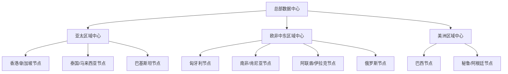
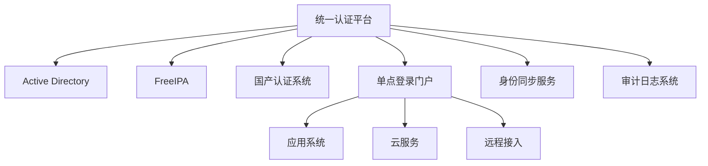

# IT架构总体规划

## 1. 网络架构总览

### 1.1 整体架构


### 1.2 核心架构设计
1. **骨干网络**
   - 三层区域中心架构
   - SD-WAN技术
   - CDN加速节点
   - 全互联网络

2. **数据中心布局**
   - 主数据中心：香港/新加坡
   - 区域数据中心：
     * 亚太：新加坡/香港
     * 欧非中东：匈牙利
     * 美洲：巴西

3. **网络服务**
   - 统一通信平台
   - 分布式存储系统
   - 全球负载均衡
   - 安全访问服务边缘(SASE)

## 2. IP地址规划

### 2.1 主要网段划分
```yaml
# 总部数据中心
headquarters:
  network: 10.0.0.0/16
  subnets:
    core: 10.0.0.0/24    # 核心网络设备
    servers: 10.0.1.0/24 # 服务器网段
    mgmt: 10.0.2.0/24    # 管理网段
    dmz: 10.0.3.0/24     # DMZ区
    expansion: 10.0.4.0/22 # 预留扩展

# 亚太区域
apac:
  network: 10.1.0.0/16
  nodes:
    hk_sg: 10.1.0.0/18   # 香港/新加坡节点
    th_my: 10.1.64.0/18  # 泰国/马来西亚节点
    pk: 10.1.128.0/18    # 巴基斯坦节点

# 欧非中东区域
emea:
  network: 10.2.0.0/16
  nodes:
    hu: 10.2.0.0/18      # 匈牙利节点
    za_ke: 10.2.64.0/18  # 南非/肯尼亚节点
    ae_iq: 10.2.128.0/18 # 阿联酋/伊拉克节点
    ru: 10.2.192.0/18    # 俄罗斯节点

# 美洲区域
americas:
  network: 10.3.0.0/16
  nodes:
    br: 10.3.0.0/18      # 巴西节点
    pe_ar: 10.3.64.0/18  # 秘鲁/阿根廷节点

# 特殊用途网段
special:
  vpn: 10.250.0.0/16     # VPN网段
  iot: 10.251.0.0/16     # 物联网设备
  mgmt: 10.252.0.0/16    # 管理网络
  dr: 10.253.0.0/16      # 灾备网络
```

### 2.2 VLAN规划
```yaml
vlan_assignments:
  core_network: 10-19     # 核心网络VLAN
  servers: 20-29          # 服务器区VLAN
  office: 30-39          # 办公区VLAN
  dmz: 40-49             # DMZ区VLAN
  management: 90-99      # 管理网络VLAN
```

## 3. 认证架构

### 3.1 多源认证体系


### 3.2 分区部署
1. **中国区域**
   - 主要使用国产认证系统
   - 支持国密算法
   - 满足等保要求
   - 数据本地化存储

2. **亚太区域**
   - AD + FreeIPA混合部署
   - 多因素认证
   - 统一身份管理
   - 数据同步机制

3. **欧美区域**
   - 以AD为主
   - 符合GDPR要求
   - 跨区域认证
   - 高可用部署

### 3.3 认证协议支持
```yaml
authentication_protocols:
  supported:
    - LDAP/LDAPS
    - Kerberos
    - SAML 2.0
    - OAuth 2.0
    - OpenID Connect
    - 国密SSL/TLS
```

## 4. 数据中心规划

### 4.1 主数据中心（香港）
1. **基础设施**
   - 等级：Tier III+
   - 面积：2000平方米
   - 机柜数：200个
   - 功率密度：8kW/机柜

2. **网络设施**
   - 骨干带宽：100Gbps
   - 互联网出口：40Gbps
   - 运营商：3家以上
   - BGP多线接入

3. **安全设施**
   - 物理安全：7x24小时保安
   - 消防系统：气体灭火
   - 门禁系统：生物识别
   - 视频监控：全覆盖

### 4.2 灾备中心（新加坡）
1. **基础设施**
   - 等级：Tier III
   - 面积：1000平方米
   - 机柜数：100个
   - 功率密度：6kW/机柜

2. **灾备能力**
   - RTO：4小时
   - RPO：15分钟
   - 同步复制：关键数据
   - 异步复制：普通数据

### 4.3 区域数据中心
1. **欧洲（匈牙利）**
   - 机柜数：50个
   - 本地存储：满足GDPR
   - 网络：就近接入
   - 安全：符合欧盟标准

2. **美洲（巴西）**
   - 机柜数：50个
   - 本地存储：满足本地法规
   - 网络：南美区域中心
   - 安全：符合SOX要求

## 5. 网络服务规划

### 5.1 统一通信平台
1. **视频会议系统**
   - 支持4K视频
   - 全球部署
   - 智能调度
   - 录制存档

2. **即时通讯系统**
   - 全球部署
   - 消息加密
   - 文件传输
   - 移动支持

### 5.2 存储系统
1. **分布式存储**
   - 全球分布
   - 就近访问
   - 数据同步
   - 容灾备份

2. **备份系统**
   - 多级备份
   - 加密存储
   - 快速恢复
   - 归档管理

## 6. 扩展规划

### 6.1 预留资源
1. **网络资源**
   - IP地址空间
   - 带宽容量
   - 设备端口
   - 机柜空间

2. **系统资源**
   - 计算资源
   - 存储空间
   - 许可证数量
   - 管理容量

### 6.2 升级路径
1. **网络升级**
   - 带宽扩容
   - 设备更新
   - 协议升级
   - 安全加强

2. **系统升级**
   - 版本更新
   - 功能扩展
   - 性能优化
   - 安全加固

## 7. 运维管理

### 7.1 监控体系
```yaml
monitoring_systems:
  network:
    - 性能监控
    - 流量分析
    - 故障告警
    - 日志审计
    
  systems:
    - 资源监控
    - 性能分析
    - 事件告警
    - 安全审计
```

### 7.2 运维流程
1. **日常运维**
   - 巡检制度
   - 变更管理
   - 问题处理
   - 升级维护

2. **应急响应**
   - 故障处理
   - 灾难恢复
   - 应急预案
   - 演练评估