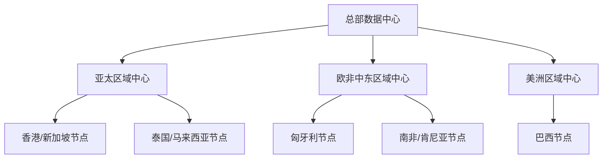

# IT架构总体规划

## 1. 网络架构

### 1.1 整体架构

### 1.2 IP地址规划
- 总部数据中心: 10.0.0.0/16
- 亚太区域: 10.1.0.0/16 
- 欧非中东: 10.2.0.0/16
- 美洲区域: 10.3.0.0/16

## 2. 认证架构

### 2.1 统一认证体系
- 中国区域: 国产认证系统
- 亚太区域: AD + FreeIPA混合
- 其他区域: AD为主

## 3. 数据中心规划

### 3.1 主数据中心
- 位置: 香港
- 等级: Tier III+
- 容量: 200机柜

### 3.2 灾备中心
- 位置: 新加坡
- 等级: Tier III
- 容量: 100机柜