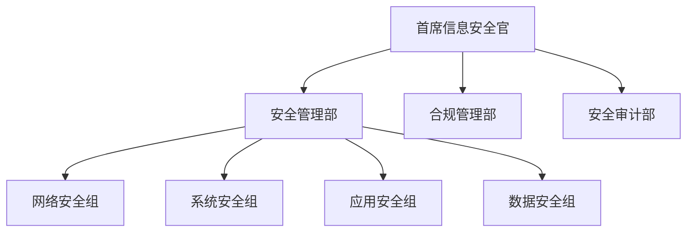

# 安全规范与实施指南

## 1. 安全管理架构

### 1.1 组织架构


### 1.2 职责分工
- **安全管理部**: 策略制定、技术实施
- **合规管理部**: 法规遵从、风险评估
- **安全审计部**: 安全检查、审计评估

## 2. 加密算法规范

### 2.1 禁用的算法和协议
```yaml
# 禁用的加密算法
prohibited:
  symmetric:
    - DES            # 密钥长度不足
    - 3DES           # 已被证明不安全
    - RC4            # 存在多个漏洞
    - Blowfish       # 密钥长度不足
    
  asymmetric:
    - RSA (< 2048-bit)  # 密钥长度不足
    - DSA              # 已被证明存在问题
    
  hash:
    - MD5             # 已被证明不安全
    - SHA1            # 已被证明不安全
    
  protocols:
    - SSL 2.0/3.0     # 严重不安全
    - TLS 1.0/1.1     # 存在已知漏洞
```

### 2.2 推荐的算法和协议
```yaml
# 推荐使用的算法
approved:
  symmetric:
    - AES-256-GCM    # 首选，提供认证加密
    - ChaCha20-Poly1305  # 高性能选项
    
  asymmetric:
    - RSA-4096/2048
    - ECC (P-256/384/521)
    - Ed25519
    
  hash:
    - SHA-256
    - SHA-384
    - SHA-512
    
  protocols:
    - TLS 1.2        # 配置安全密码套件
    - TLS 1.3        # 首选
```

## 3. 网络安全配置

### 3.1 防火墙策略
```yaml
# 基础安全策略
security_policy:
  # 外网到DMZ
  internet-to-dmz:
    permit:
      - service: HTTPS
        dst-port: 443
      - service: HTTP
        dst-port: 80
      - service: DNS
        dst-port: 53
    deny: default

  # DMZ到内网
  dmz-to-internal:
    permit:
      - service: DB
        dst-port: 1521
        src-ip: 172.16.1.0/24
        dst-ip: 10.0.2.0/24
    deny: default

  # 内网到外网
  internal-to-internet:
    permit:
      - service: HTTPS
        dst-port: 443
      - service: HTTP
        dst-port: 80
      - service: DNS
        dst-port: 53
    deny: default
```

### 3.2 VPN配置
```yaml
# SSL VPN配置
ssl_vpn:
  protocols:
    enable:
      - TLS 1.2
      - TLS 1.3
    disable:
      - SSL 2.0/3.0
      - TLS 1.0/1.1
      
  cipher_suites:
    - TLS_AES_256_GCM_SHA384
    - TLS_CHACHA20_POLY1305_SHA256
    - ECDHE-RSA-AES256-GCM-SHA384

# IPSec VPN配置
ipsec_vpn:
  phase1:
    encryption: AES-256-GCM
    integrity: SHA-384
    dh_group: 19 (ECP-384)
  
  phase2:
    encryption: AES-256-GCM
    integrity: SHA-384
```

### 3.3 无线网络安全
```yaml
# 企业网络配置
enterprise_wifi:
  ssid: CORP-INTERNAL
  hidden: true
  security:
    protocol: WPA3-Enterprise
    encryption: AES-256-GCM
    authentication: EAP-TLS
    certificates:
      type: RSA
      min_length: 2048
    pmf: required

# BYOD网络配置
byod_wifi:
  ssid: CORP-BYOD
  security:
    protocol: WPA3-Enterprise
    encryption: AES-256-GCM
    authentication:
      primary: EAP-TLS
      fallback: PEAP-MSCHAPv2 + 2FA
```

## 4. 终端安全管理

### 4.1 终端安全基线
```yaml
# Windows终端基线
windows_baseline:
  os_version: "Windows 10/11 Enterprise"
  update:
    security_updates: required
    feature_updates: controlled
  hardening:
    password_policy:
      min_length: 12
      complexity: enabled
      history: 12
      max_age: 90
    account_policy:
      lockout_threshold: 5
      lockout_duration: 30
    audit_policy:
      login_events: success_failure
      object_access: success_failure
      policy_change: success_failure

# macOS终端基线
macos_baseline:
  os_version: "macOS 12 or later"
  security:
    filevault: enabled
    firewall: enabled
    sip: enabled
  updates:
    system_updates: automatic
    app_updates: controlled
```

### 4.2 移动设备管理
```yaml
# BYOD管理策略
byod_policy:
  device_requirements:
    os_version:
      ios: ">=13.0"
      android: ">=10.0"
    security:
      - device_encryption
      - password_protection
      - remote_wipe_capability
      
  application_control:
    required_apps:
      - mdm_client
      - vpn_client
      - email_client
    prohibited_apps:
      - rooted_tools
      - unauthorized_vpn
```

## 5. 数据安全

### 5.1 数据分级
```yaml
classification:
  level_1: # 绝密
    - 战略规划
    - 核心技术
    - 财务数据
    encryption: AES-256-GCM
  level_2: # 机密
    - 客户信息
    - 员工数据
    - 合同文件
    encryption: AES-256-GCM
  level_3: # 内部
    - 内部制度
    - 操作手册
    - 培训资料
    encryption: AES-256-CBC
  level_4: # 公开
    - 宣传材料
    - 公开信息
    - 产品介绍
    encryption: optional
```

### 5.2 数据保护要求
1. **存储加密**
   - 所有机密及以上级别数据必须使用AES-256-GCM加密
   - 加密密钥必须使用硬件安全模块(HSM)管理
   - 禁止使用弱加密算法和不安全的加密模式

2. **传输加密**
   - 必须使用TLS 1.2或更高版本
   - 禁止使用SSL和TLS 1.0/1.1
   - 必须使用强密码套件
   - 证书密钥长度至少2048位

## 6. 安全审计

### 6.1 审计范围
```yaml
audit_scope:
  systems:
    - 操作系统
    - 数据库
    - 应用系统
    - 网络设备
  
  operations:
    - 用户活动
    - 系统变更
    - 数据访问
    - 安全事件
```

### 6.2 审计策略
```yaml
audit_policy:
  frequency:
    routine: daily
    detailed: monthly
    comprehensive: quarterly
    
  retention:
    security_logs: 365_days
    system_logs: 180_days
    audit_reports: 3_years
```

## 7. 应急响应

### 7.1 响应流程


### 7.2 应急预案
1. **安全事件分类**
   - 数据泄露
   - 系统入侵
   - 恶意代码
   - 拒绝服务

2. **响应措施**
   - 隔离受影响系统
   - 保存证据
   - 消除威胁
   - 恢复服务

## 8. 合规管理

### 8.1 法规遵从
- 网络安全法
- 数据安全法
- GDPR
- SOX法案

### 8.2 安全培训
1. **培训计划**
   - 新员工培训
   - 定期培训
   - 专项培训
   - 意识提升

2. **考核制度**
   - 在线测试
   - 实操考核
   - 效果评估
   - 持续改进