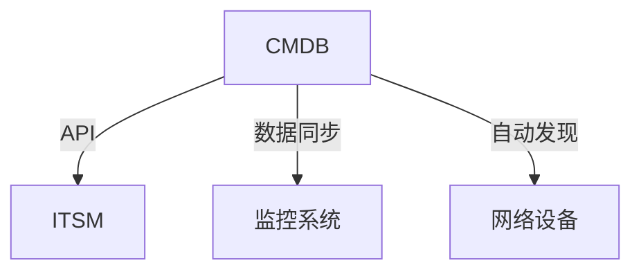

# CMDB系统调研报告

## 1. CMDB基础概念

### 1.1 什么是CMDB

CMDB（Configuration Management Database）配置管理数据库，是ITIL框架中的核心组件，用于：

- 集中存储所有IT资产和配置项(CI)信息
- 记录配置项之间的关系
- 支持变更管理和影响分析
- 作为ITSM系统的基础数据库

### 1.2 核心功能


## 2. 主流开源CMDB方案

### 2.1 iTop

**特点**：

- 完全遵循ITIL标准
- 支持CMDB+ITSM功能集成
- 丰富的插件生态系统
- 中文社区活跃

**技术栈**：

- PHP/MySQL
- Web界面

**部署难度**：★★★☆☆

**官网**：<https://www.combodo.com/itop>

### 2.2 CMDBuild

**特点**：

- 高度可定制的工作流
- 可视化关系编辑器
- 支持GIS地理信息系统
- 完善的权限控制

**技术栈**：

- Java/Tomcat/PostgreSQL
- 支持Docker部署

**部署难度**：★★★★☆

**官网**：<https://www.cmdbuild.org/>

### 2.3 Open-AudIT

**特点**：

- 专注于自动发现和审计
- 强大的网络设备发现能力
- 支持API集成
- 轻量级架构

**技术栈**：

- PHP/MySQL
- 支持Windows/Linux

**部署难度**：★★☆☆☆

**官网**：<https://open-audit.org/>

## 3. 方案对比

| 特性        | iTop       | CMDBuild   | Open-AudIT |
|------------|------------|------------|------------|
| ITIL兼容性 | 优秀       | 优秀       | 一般       |
| 自动发现    | 插件支持   | 基础支持   | 核心功能   |
| 自定义能力 | 中等       | 极强       | 有限       |
| 学习曲线    | 中等       | 陡峭       | 平缓       |
| 中文支持    | 完善       | 部分       | 有限       |

## 4. 部署建议

### 4.1 基础环境要求

```yaml
最低配置:
  - CPU: 4核
  - 内存: 8GB
  - 存储: 100GB
  - OS: CentOS 7+/Ubuntu 18.04+

推荐配置:
  - CPU: 8核
  - 内存: 16GB
  - 存储: 500GB SSD
```

### 4.2 部署步骤

1. **环境准备**
   - 安装Docker/数据库
   - 配置防火墙规则

2. **系统安装**

   ```bash
   # iTop示例
   wget https://sourceforge.net/projects/itop/files/latest/download
   unzip itop-*.zip -d /var/www/html/
   ```

3. **初始化配置**
   - 运行安装向导
   - 配置管理员账户
   - 设置自动发现任务

4. **数据迁移**
   - 导入现有资产数据
   - 配置关系映射

## 5. 集成方案

### 5.1 与现有系统集成



### 5.2 推荐集成方式

1. **API接口**
   - RESTful API标准集成
   - 定时数据同步

2. **数据库直连**
   - 只读账户访问
   - 定时ETL作业

3. **文件交换**
   - CSV/JSON导入导出
   - 自动化脚本处理

## 6. 实施路线图

1. **评估阶段**（1个月）
   - 需求分析
   - 方案选型
   - 测试环境部署

2. **试点阶段**（2个月）
   - 核心资产入库
   - 关键关系建模
   - 用户培训

3. **推广阶段**（3个月）
   - 全量资产入库
   - 系统集成
   - 流程优化

## 7. 后续建议

1. 先从小规模试点开始（如先导入网络设备数据）
2. 建立专门的CMDB维护团队
3. 制定数据质量管理制度
4. 定期审计数据准确性
5. 与ITSM流程深度集成
