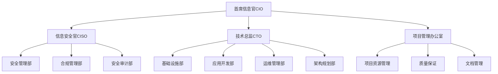

# IT部门组织架构规划

## 1. 组织架构总览



## 2. 区域IT组织架构

### 2.1 总部IT组织

- 直接向集团CIO汇报
- 负责全球IT战略规划
- 制定全球IT标准规范
- 管理跨区域重大项目
- 协调区域间IT资源

### 2.2 区域IT组织

- 向区域总经理和集团CIO双线汇报
- 执行区域IT运营管理
- 落实集团IT战略
- 支持本地业务需求
- 管理区域IT预算

### 2.3 本地IT支持

- 向区域IT主管汇报
- 提供现场技术支持
- 维护本地IT设施
- 执行日常运维工作
- 响应用户需求

## 3. 部门职责

### 3.1 基础设施部

- **网络团队**
  - 全球网络规划与建设
  - 网络性能优化
  - 故障处理与维护
  - 带宽资源管理

- **系统团队**
  - 服务器管理维护
  - 存储系统规划
  - 虚拟化平台管理
  - 操作系统标准化

- **终端团队**
  - 终端设备管理
  - 桌面环境标准化
  - 终端安全管理
  - 用户支持服务

### 3.2 应用开发部

- **业务系统团队**
  - 核心业务系统开发
  - 系统集成与对接
  - 应用性能优化
  - 系统升级维护

- **创新技术团队**
  - 新技术评估与引入
  - 技术创新项目
  - 概念验证(POC)
  - 技术预研

- **质量保证团队**
  - 测试规划与执行
  - 质量标准制定
  - 自动化测试
  - 性能测试

### 3.3 运维管理部

- **运维团队**
  - 系统日常运维
  - 变更管理
  - 问题处理
  - 性能监控

- **服务台团队**
  - 用户支持
  - 事件管理
  - 知识库维护
  - 服务质量管理

- **自动化团队**
  - 运维自动化
  - 工具开发维护
  - 流程优化
  - 监控平台建设

### 3.4 架构规划部

- **企业架构团队**
  - 技术架构规划
  - 标准规范制定
  - 架构评审
  - 技术路线图

- **解决方案团队**
  - 技术方案设计
  - 系统集成方案
  - 技术选型
  - 架构优化

### 3.5 安全管理部

- **安全运营团队**
  - 安全监控
  - 事件响应
  - 漏洞管理
  - 安全加固

- **安全开发团队**
  - 安全架构设计
  - 安全编码规范
  - 安全测试
  - 安全工具开发

### 3.6 合规管理部

- **合规团队**
  - 合规要求收集
  - 合规评估
  - 政策制定
  - 合规培训

- **风险管理团队**
  - 风险评估
  - 控制措施制定
  - 风险监控
  - 应急预案

## 4. 人员配置

### 4.1 总部配置

```yaml
# 总部IT人员配置
departments:
  CIO_Office: 5
  CISO_Office: 3
  CTO_Office: 4
  PMO: 8
  Infrastructure: 20
  Development: 30
  Operations: 25
  Architecture: 15
  Security: 12
  Compliance: 10
```

### 4.2 区域配置

```yaml
# 区域IT人员配置（每个区域）
regional_staff:
  Management: 3
  Infrastructure: 10
  Development: 15
  Operations: 12
  Security: 5
  Support: 8
```

### 4.3 本地配置

```yaml
# 本地IT人员配置（每个节点）
local_staff:
  Infrastructure: 3
  Support: 5
  Security: 1
```

## 5. 工作流程

### 5.1 项目管理流程

1. 需求收集与评估
2. 项目立项审批
3. 资源分配计划
4. 项目执行监控
5. 验收与交付
6. 运维移交

### 5.2 变更管理流程

1. 变更申请
2. 影响评估
3. 变更审批
4. 实施计划
5. 变更执行
6. 结果验证

### 5.3 问题管理流程

1. 问题识别
2. 优先级评估
3. 问题分析
4. 解决方案制定
5. 方案实施
6. 效果验证

## 6. 考核指标

### 6.1 部门KPI

```yaml
# 部门关键绩效指标
infrastructure:
  - 系统可用性
  - 网络性能
  - 故障解决时间
  - 资源使用效率

development:
  - 项目交付及时率
  - 代码质量
  - 系统性能
  - 用户满意度

operations:
  - 服务水平达成率
  - 问题解决时效
  - 变更成功率
  - 自动化程度

security:
  - 安全事件响应时间
  - 漏洞修复率
  - 安全合规度
  - 安全意识培训覆盖率
```

### 6.2 个人KPI

- 工作质量
- 技术能力
- 团队协作
- 创新贡献
- 文档完整性

## 7. 培训发展

### 7.1 培训体系

- 新员工入职培训
- 技术能力培训
- 管理能力培训
- 合规意识培训
- 安全意识培训

### 7.2 职业发展

- 技术专家路线
- 项目管理路线
- 技术管理路线
- 架构师路线

## 8. 沟通机制

### 8.1 例会制度

- 周例会：部门内部工作同步
- 月例会：跨部门协调会议
- 季度会：战略规划与回顾
- 年度会：总结与规划

### 8.2 汇报制度

- 日常工作汇报
- 周报制度
- 月度总结
- 季度述职
- 年度考核
