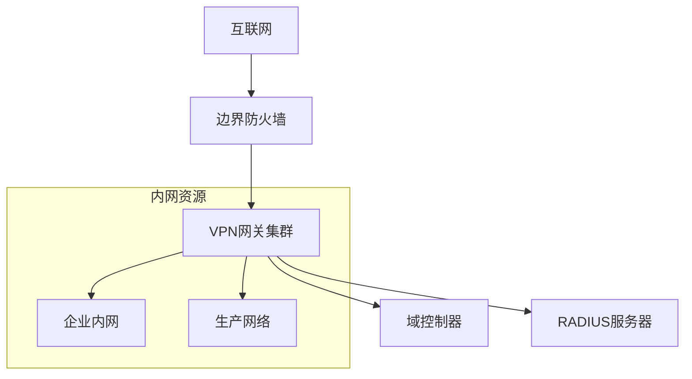

# VPN接入方案

## 1. 总体架构

### 1.1 VPN架构图


### 1.2 接入方式
1. **SSL VPN**
   - 网页门户访问
   - 客户端软件接入
   - 移动设备接入

2. **IPSec VPN**
   - 站点间VPN
   - 第三方专线备份
   - 灾备链路

## 2. SSL VPN配置

### 2.1 基础配置
```bash
# SSL VPN基础配置
ssl-vpn
 port 443
 max-users 1000
 idle-timeout 30
 session-timeout 480
 certificate ssl-cert
 authentication-method radius

# 地址池配置
ip local pool VPN-POOL 10.250.0.0 10.250.0.254 mask 255.255.255.0
```

### 2.2 认证配置
```yaml
# RADIUS配置
radius-server:
  primary:
    host: 10.0.0.20
    port: 1812
    key: "encrypted-shared-key"
  secondary:
    host: 10.0.0.21
    port: 1812
    key: "encrypted-shared-key"

# 证书配置
certificates:
  server-cert:
    subject: "CN=vpn.company.com"
    issuer: "Company CA"
    valid-from: "2024-01-01"
    valid-to: "2026-01-01"
    key-size: 2048
```

### 2.3 访问策略
```yaml
# 访问控制策略
access-policies:
  # 普通员工策略
  employee:
    resources:
      - network: 10.0.0.0/16
        services: [HTTP, HTTPS, RDP]
      - network: 10.1.0.0/16
        services: [HTTP, HTTPS]
    restrictions:
      max-sessions: 1
      allowed-time: "08:00-20:00"
      
  # IT管理员策略
  it-admin:
    resources:
      - network: 10.0.0.0/8
        services: [ALL]
    restrictions:
      max-sessions: 2
      allowed-time: "00:00-24:00"
      
  # 外部合作方策略
  partner:
    resources:
      - network: 10.2.0.0/16
        services: [HTTP, HTTPS]
    restrictions:
      max-sessions: 1
      allowed-time: "09:00-18:00"
```

## 3. IPSec VPN配置

### 3.1 站点间VPN
```bash
# Phase 1配置（IKE）
crypto ikev2 proposal MAIN-PROP
 encryption aes-gcm-256      # 使用AES-GCM提供AEAD
 integrity sha384           # 更强的完整性保护
 group 19                  # NIST P-384曲线，更强的DH组

crypto ikev2 policy MAIN-POL
 proposal MAIN-PROP
 
# Phase 2配置（IPSec）
crypto ipsec transform-set MAIN-TRANS esp-gcm 256  # 使用AES-GCM
 mode tunnel
 
# 禁用不安全的加密和哈希算法
no crypto ipsec transform-set LEGACY-TRANS esp-3des
no crypto ipsec transform-set LEGACY-TRANS esp-md5-hmac
no crypto ipsec transform-set LEGACY-TRANS esp-sha1-hmac

# 隧道配置
crypto map MAIN-MAP 10 ipsec-isakmp
 set peer 203.0.113.2
 set transform-set MAIN-TRANS
 match address IPSEC-ACL
```

### 3.2 传输安全
```yaml
# 安全协议配置
security-protocols:
  phase1:
    - encryption: AES-256
    - hash: SHA256
    - dh-group: 14
    - lifetime: 28800
  
  phase2:
    - encryption: AES-256
    - hash: SHA256
    - pfs: group14
    - lifetime: 3600
```

## 4. 客户端配置

### 4.1 SSL VPN客户端
```yaml
# 客户端配置文件
client-config:
  server:
    primary: vpn.company.com
    backup: vpn2.company.com
    port: 443
  
  connection:
    retry-interval: 30
    max-retry: 3
    
  authentication:
    method: certificate
    cert-store: user-store
    
  proxy:
    type: auto
    pac-url: http://proxy.company.com/proxy.pac
```

### 4.2 移动设备配置
```yaml
# 移动设备策略
mobile-policy:
  allowed-devices:
    - ios: ">=13.0"
    - android: ">=10.0"
    
  mdm-requirements:
    - device-encryption
    - screen-lock
    - minimum-password-length: 6
    
  restrictions:
    - no-jailbreak
    - no-root
    - secure-boot-required
```

## 5. 高可用性设计

### 5.1 VPN网关集群
```yaml
# 集群配置
cluster:
  nodes:
    - hostname: vpn-gw-01
      role: master
      priority: 100
    - hostname: vpn-gw-02
      role: backup
      priority: 90
      
  vip:
    external: 203.0.113.100
    internal: 10.0.0.100
    
  sync:
    interface: ha1/0
    encryption: aes256
```

### 5.2 负载均衡
```yaml
# 负载均衡配置
load-balancer:
  algorithm: round-robin
  health-check:
    interval: 5
    timeout: 2
    retries: 3
  
  persistence:
    type: source-ip
    timeout: 600
```

## 6. 监控告警

### 6.1 监控指标
```yaml
# 关键监控指标
monitoring:
  performance:
    - cpu-usage
    - memory-usage
    - concurrent-users
    - bandwidth-usage
    
  security:
    - failed-login-attempts
    - certificate-errors
    - ipsec-tunnel-status
    
  availability:
    - service-status
    - cluster-status
    - connection-latency
```

### 6.2 告警配置
```yaml
# 告警阈值
alerts:
  critical:
    cpu-usage: 90%
    memory-usage: 85%
    concurrent-users: 95%
    failed-logins: 10/minute
    
  warning:
    cpu-usage: 75%
    memory-usage: 70%
    concurrent-users: 80%
    failed-logins: 5/minute
```

## 7. 应急预案

### 7.1 故障处理流程
1. **VPN服务中断**
   - 检查网关状态
   - 切换备用节点
   - 恢复服务配置
   - 通知用户

2. **认证系统故障**
   - 启用本地认证
   - 修复认证服务
   - 同步用户数据
   - 恢复正常认证

### 7.2 安全事件响应
1. **异常访问处理**
   - 锁定可疑账号
   - 分析访问日志
   - 加强访问控制
   - 更新安全策略

2. **系统入侵处理**
   - 隔离受影响系统
   - 分析入侵途径
   - 修复安全漏洞
   - 恢复正常服务

## 8. 运维管理

### 8.1 日常维护
```bash
# 状态检查
show vpn status
show cluster status
show user-sessions

# 性能监控
show cpu usage
show memory usage
show bandwidth usage

# 日志审计
show vpn-logs
show auth-logs
show security-logs
```

### 8.2 变更管理
1. **配置变更流程**
   - 变更申请
   - 方案评审
   - 备份配置
   - 实施变更
   - 效果验证

2. **版本升级流程**
   - 兼容性测试
   - 制定升级计划
   - 用户通知
   - 分批升级
   - 结果验证

## 9. 最佳实践

### 9.1 安全建议
1. 启用双因素认证
2. 定期更新证书
3. 限制登录失败次数
4. 实施设备准入控制
5. 定期审计访问日志

### 9.2 性能优化
1. 合理规划地址池
2. 优化加密算法选择
3. 调整会话参数
4. 配置合适的超时时间
5. 实施带宽管理