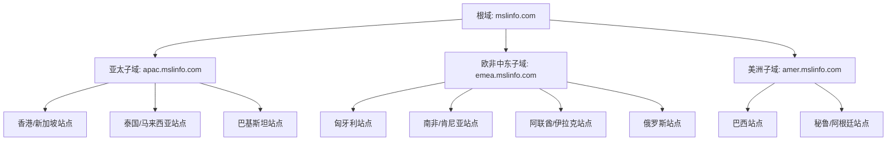

# Windows域部署方案

## 1. 域架构设计



## 2. 域控制器部署

### 2.1 根域控制器
- 主域控制器：2台（主数据中心）
- 全局编录服务器：2台（主数据中心）
- 功能级别：Windows Server 2019

### 2.2 区域域控制器
每个区域中心部署：
- 子域域控制器：2台
- 全局编录服务器：1台
- 只读域控制器（RODC）：按需部署

### 2.3 本地站点域控制器
每个本地站点部署：
- 只读域控制器（RODC）：1台
- 缓存凭据策略：缓存最近1000个登录用户

## 3. 域功能配置

### 3.1 组织单位(OU)结构
```
mslinfo.com
├── 总部
│   ├── 用户
│   ├── 计算机
│   └── 服务器
├── 区域中心
│   ├── APAC
│   ├── EMEA
│   └── AMER
└── 本地站点
    ├── 用户
    └── 计算机
```

### 3.2 组策略配置
- 密码策略：12位密码，90天更换
- 安全策略：BitLocker加密，USB控制
- 软件部署：标准办公软件包
- 网络配置：代理服务器，VPN设置

## 4. 高可用性设计

### 4.1 域控制器冗余
- 每个位置至少2台域控制器
- 采用多主复制模型
- 配置站点链接成本优化复制流量

### 4.2 备份策略
- 系统状态每日备份
- AD数据库每4小时备份
- SYSVOL每日备份
- 跨站点备份复制

## 5. 网络配置

### 5.1 站点链接配置
- 站点间复制间隔：15分钟
- 压缩复制数据
- 配置复制计划避开高峰期

### 5.2 DNS配置
- 每个站点部署DNS服务器
- 配置条件转发器
- 实现智能DNS解析

## 6. 安全加固

### 6.1 域控制器安全
- 启用安全审核
- 限制远程访问
- 实施最小权限原则
- 定期安全补丁更新

### 6.2 监控告警
- 配置安全事件日志
- 监控域控制器性能
- 复制状态监控
- 证书服务监控

## 7. 实施步骤

1. 部署根域控制器
2. 配置站点和服务
3. 部署区域域控制器
4. 部署本地站点域控制器
5. 配置组策略
6. 迁移用户和计算机
7. 测试和优化

该方案基于约400-500个终端设备的规模设计，提供了足够的冗余和扩展性，同时考虑了全球化部署的特殊需求。