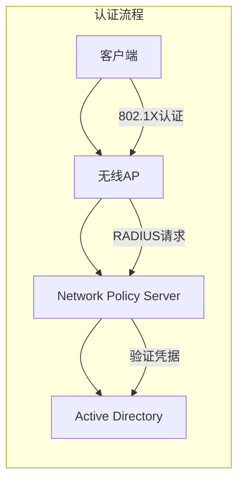

# 企业WiFi认证方案详细设计

## 1. 认证架构总览



## 2. 网络环境说明

### 2.1 隐藏SSID网络（域设备自动连接）
- SSID名称：CORP-HIDDEN（隐藏广播）
- 认证方式：WPA3-Enterprise
- 加密方式：AES-256
- 认证协议：EAP-TLS（基于证书）

### 2.2 开放SSID网络（域账户认证）
- SSID名称：CORP-BYOD（公开广播）
- 认证方式：WPA3-Enterprise
- 加密方式：AES-256
- 认证协议：PEAP-MSCHAPv2（用户名密码）

## 3. 认证原理详解

### 3.1 802.1X认证流程
1. **认证请求**
   - 客户端发送EAPOL-Start消息
   - AP响应EAP-Request/Identity
   - 客户端发送EAP-Response/Identity

2. **RADIUS认证**
   - AP将认证请求转发给RADIUS服务器
   - RADIUS服务器验证用户凭据
   - 返回接受/拒绝结果

3. **密钥交换**
   - 生成动态会话密钥
   - 建立加密通信通道

### 3.2 证书认证（隐藏SSID）
1. **证书部署**
   - 通过组策略自动部署计算机证书
   - 证书包含设备身份信息
   - 证书与域计算机账户绑定

2. **自动连接**
   - 设备证书自动完成身份验证
   - 无需用户手动输入凭据
   - 基于计算机账户实现认证

### 3.3 用户认证（开放SSID）
1. **凭据验证**
   - 用户输入域账户和密码
   - 通过PEAP隧道保护凭据传输
   - RADIUS服务器验证AD凭据

2. **动态VLAN分配**
   - 基于用户组成员身份
   - 自动分配适当的VLAN
   - 实现网络访问控制

## 4. 详细部署步骤

### 4.1 证书服务器配置

```powershell
# 1. 安装证书服务器角色
Install-WindowsFeature -Name AD-Certificate -IncludeManagementTools

# 2. 配置证书模板
# 打开证书模板管理器
# 复制"计算机"模板
# 配置新模板属性：
# - 模板显示名称：WiFiAuth
# - 有效期：2年
# - 密钥用途：客户端认证
# - 允许自动注册

# 3. 发布证书模板
certutil -setcatemplates +WiFiAuth
```

### 4.2 NPS服务器配置

```powershell
# 1. 安装NPS角色
Install-WindowsFeature -Name NPAS -IncludeManagementTools

# 2. 注册RADIUS服务器
netsh nps add radius "WiFi Authentication"

# 3. 配置RADIUS客户端（无线AP）
# NPS控制台 -> RADIUS客户端
# - 添加AP的IP地址
# - 配置共享密钥
```

#### RADIUS策略配置
```yaml
# 连接请求策略
Name: WiFi-Auth-Policy
Conditions:
  - NAS-Port-Type: Wireless-IEEE802.11
  - Authentication-Type: EAP
Processing-Order: 1

# 网络策略
Name: WiFi-Network-Policy
Conditions:
  - Windows-Groups: Domain Computers
Access-Permission: Grant
Authentication-Methods:
  - EAP-TLS
  - PEAP-MSCHAPv2
```

### 4.3 无线控制器配置

```yaml
# WLAN配置
hidden_ssid:
  name: CORP-HIDDEN
  broadcast: false
  security:
    type: WPA3-Enterprise
    encryption: AES-256
    radius:
      server: nps.corp.local
      port: 1812
      secret: your_shared_secret
    eap:
      types: 
        - EAP-TLS

open_ssid:
  name: CORP-BYOD
  broadcast: true
  security:
    type: WPA3-Enterprise
    encryption: AES-256
    radius:
      server: nps.corp.local
      port: 1812
      secret: your_shared_secret
    eap:
      types:
        - PEAP-MSCHAPv2
```

### 4.4 组策略配置

```powershell
# 1. 创建WiFi策略GPO
New-GPO -Name "WiFi-Authentication-Policy"

# 2. 配置证书自动注册
# 计算机配置 -> 策略 -> Windows设置 -> 安全设置 -> 公钥策略
# - 启用自动证书申请
# - 选择WiFiAuth证书模板

# 3. 配置无线网络策略
# 计算机配置 -> 策略 -> Windows设置 -> 安全设置 -> 无线网络策略
$xmlConfig = @"
<?xml version="1.0"?>
<WLANProfile>
    <name>CORP-HIDDEN</name>
    <SSIDConfig>
        <SSID>
            <name>CORP-HIDDEN</name>
            <hidden>true</hidden>
        </SSID>
    </SSIDConfig>
    <connectionType>ESS</connectionType>
    <connectionMode>auto</connectionMode>
    <autoSwitch>false</autoSwitch>
    <MSM>
        <security>
            <authEncryption>
                <authentication>WPA3-Enterprise</authentication>
                <encryption>AES</encryption>
                <useOneX>true</useOneX>
            </authEncryption>
            <OneX>
                <EAPConfig>
                    <EAPType>13</EAPType>
                    <ClientCertificate>
                        <automaticSelection>true</automaticSelection>
                    </ClientCertificate>
                </EAPConfig>
            </OneX>
        </security>
    </MSM>
</WLANProfile>
"@

# 4. 应用组策略
Set-GPRegistryValue -Name "WiFi-Authentication-Policy" `
    -Key "HKLM\Software\Policies\Microsoft\Windows\Wireless\GPTWirelessPolicy" `
    -ValueName "WirelessProfile" `
    -Type String `
    -Value $xmlConfig
```

## 5. 客户端配置验证

### 5.1 域计算机自动配置
1. 运行gpupdate /force
2. 确认证书自动注册
3. 验证无线网络配置
4. 测试自动连接

### 5.2 BYOD设备配置
1. 选择CORP-BYOD网络
2. 输入域账户凭据
3. 验证证书（可选）
4. 确认网络连接

## 6. 故障排查指南

### 6.1 证书问题
```powershell
# 检查证书状态
certutil -store My
certutil -verify client.cer

# 查看证书日志
Get-EventLog -LogName System -Source "CertificateServices"
```

### 6.2 认证问题
```powershell
# 查看NPS日志
Get-EventLog -LogName Security -Source "NPS"

# 测试RADIUS连接
Test-NetConnection -ComputerName nps.corp.local -Port 1812
```

### 6.3 常见问题解决
1. **证书不自动注册**
   - 检查组策略应用状态
   - 验证证书模板权限
   - 确认自动注册服务运行

2. **无法连接隐藏SSID**
   - 检查证书有效性
   - 验证RADIUS通信
   - 确认AP配置正确

3. **域账户认证失败**
   - 检查用户账户状态
   - 验证RADIUS策略
   - 确认凭据正确性

## 7. 安全建议

### 7.1 证书安全
- 使用强密钥长度（最少2048位）
- 定期更新根证书
- 及时吊销失效证书
- 启用证书撤销检查

### 7.2 认证安全
- 启用失败尝试限制
- 实施密码复杂度要求
- 定期审计认证日志
- 监控异常访问行为

### 7.3 网络安全
- 启用WPA3加密
- 实施客户端隔离
- 配置MAC地址过滤
- 限制广播流量

## 8. 维护计划

### 8.1 日常维护
- 监控认证服务状态
- 检查证书有效期
- 审查访问日志
- 更新安全策略

### 8.2 定期维护
- 证书续期管理
- 策略有效性检查
- 性能优化调整
- 安全漏洞修补