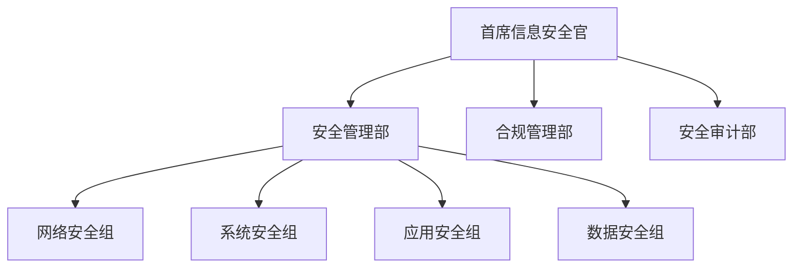
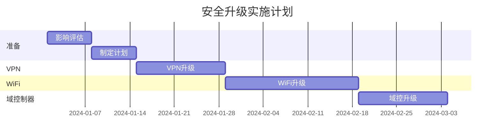

# 安全规范与实施指南

## 1. 安全管理架构

### 1.1 组织架构


### 1.2 职责分工
- **安全管理部**: 策略制定、技术实施
- **合规管理部**: 法规遵从、风险评估
- **安全审计部**: 安全检查、审计评估

## 2. 加密算法规范

### 2.1 禁用的算法和协议
```yaml
# 禁用的加密算法
prohibited:
  symmetric:
    - DES            # 密钥长度不足
    - 3DES           # 已被证明不安全
    - RC4            # 存在多个漏洞
    - Blowfish       # 密钥长度不足
    
  asymmetric:
    - RSA (< 2048-bit)  # 密钥长度不足
    - DSA              # 已被证明存在问题
    
  hash:
    - MD5             # 已被证明不安全
    - SHA1            # 已被证明不安全
    
  protocols:
    - SSL 2.0/3.0     # 严重不安全
    - TLS 1.0/1.1     # 存在已知漏洞
```

### 2.2 推荐的算法和协议
```yaml
# 推荐使用的算法
approved:
  symmetric:
    - AES-256-GCM    # 首选，提供认证加密
    - ChaCha20-Poly1305  # 高性能选项
    
  asymmetric:
    - RSA-4096/2048
    - ECC (P-256/384/521)
    - Ed25519
    
  hash:
    - SHA-256
    - SHA-384
    - SHA-512
    
  protocols:
    - TLS 1.2        # 配置安全密码套件
    - TLS 1.3        # 首选
```

## 3. 系统安全配置

### 3.1 VPN系统
```yaml
# SSL VPN配置
ssl_vpn:
  protocols:
    enable:
      - TLS 1.2
      - TLS 1.3
    disable:
      - SSL 2.0/3.0
      - TLS 1.0/1.1
      
  cipher_suites:
    - TLS_AES_256_GCM_SHA384
    - TLS_CHACHA20_POLY1305_SHA256
    - ECDHE-RSA-AES256-GCM-SHA384

# IPSec VPN配置
ipsec_vpn:
  phase1:
    encryption: AES-256-GCM
    integrity: SHA-384
    dh_group: 19 (ECP-384)
  
  phase2:
    encryption: AES-256-GCM
    integrity: SHA-384
```

### 3.2 WiFi系统
```yaml
# 企业网络配置
enterprise_wifi:
  ssid: CORP-INTERNAL
  hidden: true
  security:
    protocol: WPA3-Enterprise
    encryption: AES-256-GCM
    authentication: EAP-TLS
    certificates:
      type: RSA
      min_length: 2048
    pmf: required

# BYOD网络配置
byod_wifi:
  ssid: CORP-BYOD
  security:
    protocol: WPA3-Enterprise
    encryption: AES-256-GCM
    authentication:
      primary: EAP-TLS
      fallback: PEAP-MSCHAPv2 + 2FA
```

### 3.3 域控制器
```yaml
# Kerberos配置
kerberos:
  encryption_types:
    enable:
      - AES256-SHA384
      - AES256-SHA1
    disable:
      - RC4-HMAC
      - DES-CBC-MD5

# LDAP配置
ldap:
  require_ldaps: true
  min_tls_version: 1.2
  cipher_suites:
    - TLS_AES_256_GCM_SHA384
    - ECDHE-RSA-AES256-GCM-SHA384
```

## 4. 实施流程

### 4.1 系统升级步骤
1. **准备阶段**
   - 影响评估
   - 制定计划
   - 备份配置
   - 通知用户

2. **实施阶段**
   - 更新系统
   - 配置加密
   - 更新证书
   - 调整策略

3. **验证阶段**
   - 功能测试
   - 性能测试
   - 安全检查
   - 问题修复

### 4.2 分批实施计划


## 5. 监控与维护

### 5.1 监控指标
```yaml
# 关键监控指标
monitoring:
  security:
    - weak_algorithm_usage
    - authentication_failures
    - certificate_status
    
  performance:
    - encryption_overhead
    - authentication_latency
    - connection_success_rate
```

### 5.2 告警配置
```yaml
# 告警规则
alerts:
  critical:
    weak_algorithm:
      threshold: 0
      period: 5m
    auth_failure:
      threshold: 5
      period: 1h
      
  warning:
    cert_expiration:
      threshold: 30d
    performance_degradation:
      threshold: 50%
```

## 6. 应急预案

### 6.1 常见问题处理
1. **认证故障**
   - 启用备用认证
   - 检查证书状态
   - 验证配置正确性
   - 恢复正常服务

2. **加密问题**
   - 检查算法配置
   - 验证密钥状态
   - 更新安全策略
   - 监控系统日志

### 6.2 安全事件响应
1. **发现异常**
   - 记录详细信息
   - 评估影响范围
   - 采取临时措施
   - 通知相关方

2. **处理流程**
   - 隔离问题
   - 分析原因
   - 实施修复
   - 恢复服务
   - 总结经验

## 7. 合规性要求

### 7.1 法规遵从
- 网络安全法
- 数据安全法
- GDPR
- 行业标准

### 7.2 审计要求
- 定期安全评估
- 合规性检查
- 漏洞扫描
- 渗透测试

## 8. 培训与考核

### 8.1 培训计划
- 安全意识培训
- 技术培训
- 应急演练
- 最佳实践分享

### 8.2 考核制度
- 定期评估
- 技能认证
- 合规检查
- 绩效考核