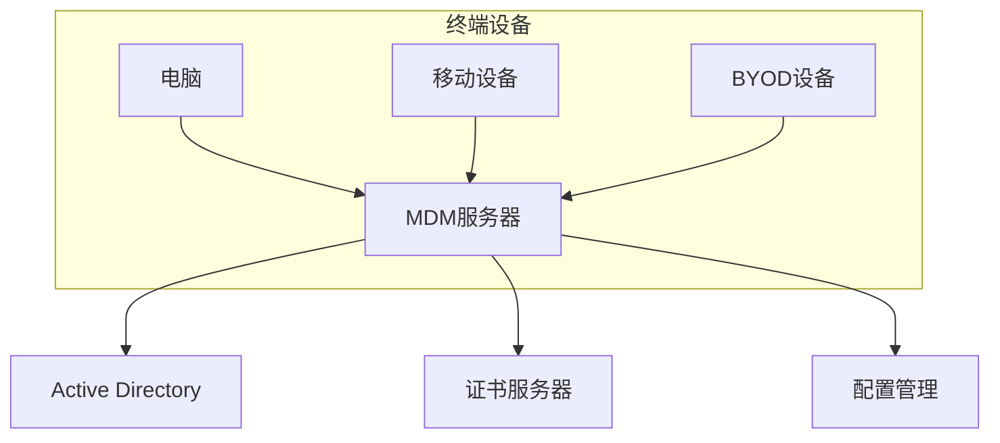

# 终端安全管理规范

## 1. 总则

### 1.1 目的
制定终端安全管理规范，规范终端设备的使用和管理，保护终端设备及其中的数据安全，降低安全风险。

### 1.2 适用范围
- 公司配发的台式机、笔记本
- 移动终端设备（平板、手机）
- BYOD设备
- 特殊终端设备

## 2. 终端安全基线

### 2.1 操作系统基线
```yaml
# Windows终端基线
windows_baseline:
  os_version: "Windows 10/11 Enterprise"
  update:
    security_updates: required
    feature_updates: controlled
  hardening:
    password_policy:
      min_length: 12
      complexity: enabled
      history: 12
      max_age: 90
    account_policy:
      lockout_threshold: 5
      lockout_duration: 30
    audit_policy:
      login_events: success_failure
      object_access: success_failure
      policy_change: success_failure

# macOS终端基线
macos_baseline:
  os_version: "macOS 12 or later"
  security:
    filevault: enabled
    firewall: enabled
    sip: enabled
  updates:
    system_updates: automatic
    app_updates: controlled
```

### 2.2 软件基线
```yaml
# 必装软件
required_software:
  security:
    - endpoint_protection
    - disk_encryption
    - vpn_client
  productivity:
    - office_suite
    - email_client
    - collaboration_tools

# 禁止软件
prohibited_software:
  categories:
    - p2p_sharing
    - unauthorized_remote_tools
    - cryptocurrency_mining
    - game_applications
```

## 3. 终端管理系统

### 3.1 MDM系统部署


### 3.2 策略配置
```yaml
# MDM策略配置
mdm_policies:
  # 设备注册
  enrollment:
    method: auto
    required: true
    deadline: 5_days
    
  # 合规检查
  compliance:
    check_interval: 4_hours
    os_version: required
    encryption: required
    antivirus: required
    
  # 应用管理
  application:
    installation: controlled
    updates: automatic
    blacklist: enforced
    
  # 数据保护
  data_protection:
    backup: required
    encryption: required
    remote_wipe: enabled
```

## 4. 访问控制

### 4.1 身份认证
1. **登录认证**
   - 域账户认证
   - 双因素认证
   - 生物识别（可选）
   - 证书认证

2. **权限分级**
   ```yaml
   # 用户权限级别
   permission_levels:
     admin:
       - system_configuration
       - software_installation
       - security_settings
     power_user:
       - software_installation
       - local_configuration
     standard_user:
       - application_usage
       - data_access
     guest:
       - internet_access
       - basic_tools
   ```

### 4.2 网络访问
1. **网络连接控制**
   - 强制使用VPN
   - 无线网络安全
   - 网络准入控制
   - 端口控制

2. **远程访问要求**
   - 加密通信
   - 会话超时
   - 访问审计
   - 连接限制

## 5. 数据安全

### 5.1 数据加密
```yaml
# 加密要求
encryption_requirements:
  full_disk:
    windows: BitLocker
    macos: FileVault
    linux: LUKS
    
  file_level:
    method: AES-256
    key_management: centralized
    
  removable_media:
    required: true
    exceptions_process: approval_required
```

### 5.2 数据备份
1. **备份策略**
   - 自动备份
   - 增量备份
   - 加密备份
   - 云端同步

2. **数据恢复**
   - 恢复流程
   - 权限控制
   - 审计记录
   - 数据验证

## 6. 安全防护

### 6.1 终端防护
```yaml
# 防护软件配置
endpoint_protection:
  antivirus:
    real_time_protection: enabled
    scheduled_scan: daily
    update_frequency: 4_hours
    
  firewall:
    status: enabled
    default_action: block
    logging: enabled
    
  dlp:
    file_monitoring: enabled
    device_control: enabled
    clipboard_control: enabled
```

### 6.2 漏洞管理
1. **漏洞扫描**
   - 定期扫描
   - 风险评估
   - 修复跟踪
   - 合规检查

2. **补丁管理**
   - 自动更新
   - 分发控制
   - 安装验证
   - 回滚机制

## 7. 移动设备管理

### 7.1 BYOD策略
```yaml
# BYOD管理策略
byod_policy:
  device_requirements:
    os_version:
      ios: ">=13.0"
      android: ">=10.0"
    security:
      - device_encryption
      - password_protection
      - remote_wipe_capability
      
  application_control:
    required_apps:
      - mdm_client
      - vpn_client
      - email_client
    prohibited_apps:
      - rooted_tools
      - unauthorized_vpn
```

### 7.2 数据隔离
1. **工作区隔离**
   - 容器化管理
   - 应用隔离
   - 数据分离
   - 访问控制

2. **远程管理**
   - 设备定位
   - 远程锁定
   - 远程擦除
   - 策略更新

## 8. 审计与监控

### 8.1 日志管理
```yaml
# 日志配置
logging_config:
  system_logs:
    retention: 180_days
    categories:
      - security_events
      - system_events
      - application_events
      
  security_logs:
    retention: 365_days
    categories:
      - login_attempts
      - policy_changes
      - data_access
```

### 8.2 监控告警
1. **实时监控**
   - 安全状态
   - 合规状态
   - 资源使用
   - 异常行为

2. **告警响应**
   - 告警级别
   - 响应流程
   - 升级机制
   - 处理记录

## 9. 应急响应

### 9.1 安全事件处理
1. **事件分类**
   - 设备丢失
   - 病毒感染
   - 数据泄露
   - 未授权访问

2. **响应流程**
   ```mermaid
   graph LR
       A[发现] --> B[报告]
       B --> C[评估]
       C --> D[处置]
       D --> E[恢复]
       E --> F[总结]
   ```

### 9.2 应急预案
1. **设备丢失**
   - 立即报告
   - 远程锁定
   - 数据擦除
   - 替代方案

2. **病毒感染**
   - 网络隔离
   - 病毒清除
   - 系统恢复
   - 影响评估

## 10. 培训与考核

### 10.1 安全培训
1. **培训内容**
   - 安全意识
   - 操作规范
   - 应急处理
   - 最新威胁

2. **培训方式**
   - 入职培训
   - 定期培训
   - 专项培训
   - 在线学习

### 10.2 考核评估
```yaml
# 考核指标
assessment_metrics:
  compliance:
    patch_level: >=95%
    encryption_status: 100%
    antivirus_status: 100%
    
  security_incidents:
    major: 0
    minor: <=2/quarter
    
  training:
    completion_rate: >=98%
    test_score: >=80%
```

## 11. 附则

### 11.1 例外管理
1. **申请流程**
   - 书面申请
   - 风险评估
   - 审批流程
   - 定期复查

2. **临时豁免**
   - 限时许可
   - 补偿控制
   - 跟踪监控
   - 到期处理

### 11.2 处罚措施
1. **违规处理**
   - 警告教育
   - 限制使用
   - 纪律处分
   - 追究责任

2. **整改要求**
   - 限期整改
   - 跟踪验证
   - 结果确认
   - 档案记录