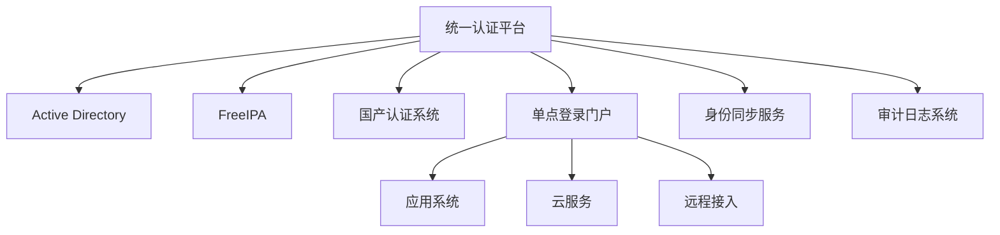

# 统一认证体系规划

## 1. 认证架构总览

### 1.1 多源认证体系



### 1.2 分区部署

- 中国区域：主要使用国产认证系统
- 亚太区域：AD + FreeIPA混合
- 欧非中东：AD为主
- 美洲区域：AD为主

## 2. 认证系统集成

### 2.1 Active Directory部署

- 主域控制器：部署在主数据中心
- 区域域控制器：各区域中心部署
- 本地域控制器：重要节点部署
- 配置：

  ```powershell
  # AD林结构
  Forest: corp.example.com
  - China.corp.example.com
  - APAC.corp.example.com
  - EMEA.corp.example.com
  - AMER.corp.example.com
  ```

### 2.2 FreeIPA部署

- 主服务器：部署在亚太区域中心
- 复制服务器：部署在各关键节点
- 配置：

  ```bash
  # FreeIPA域配置
  Domain: ipa.example.com
  Realm: IPA.EXAMPLE.COM
  ```

### 2.3 国产认证系统部署

- 主认证服务器：部署在中国区域中心
- 从认证服务器：部署在国内各节点
- 支持国密算法
- 支持国产操作系统

## 3. 统一认证平台

### 3.1 身份数据同步

- 主数据源定义
  - 员工数据：HR系统
  - 组织架构：OA系统
  - 权限数据：RBAC系统

- 同步策略

  ```yaml
  # 数据同步配置
  sync_interval: 
    employee: 4h
    organization: 12h
    permission: 6h
  
  conflict_resolution:
    priority:
      - HR_System
      - OA_System
      - AD
      - FreeIPA
      - Local_Auth
  ```

### 3.2 认证协议支持

- LDAP/LDAPS
- Kerberos
- SAML 2.0
- OAuth 2.0
- OpenID Connect
- 国密SSL/TLS

### 3.3 单点登录(SSO)

- Web应用SSO
- 移动应用SSO
- 桌面应用SSO
- VPN接入SSO

## 4. 安全策略

### 4.1 密码策略

```yaml
# 统一密码策略
password_policy:
  min_length: 12
  complexity:
    uppercase: required
    lowercase: required
    numbers: required
    special_chars: required
  history: 12
  max_age: 90
  min_age: 1
```

### 4.2 访问控制

- 基于角色的访问控制(RBAC)
- 基于属性的访问控制(ABAC)
- 零信任访问控制
- 特权账号管理

### 4.3 审计日志

- 统一日志格式
- 实时日志采集
- 集中日志存储
- 日志分析告警

## 5. 高可用设计

### 5.1 服务冗余

- 认证服务多节点部署
- 数据实时同步复制
- 负载均衡设计
- 故障自动切换

### 5.2 灾备方案

- 异地灾备部署
- 数据定期备份
- 应急恢复预案
- 离线认证支持

## 6. 合规性支持

### 6.1 国内合规

- 支持国密算法
- 支持国产操作系统
- 支持等级保护要求
- 支持密码法规要求

### 6.2 国际合规

- 符合GDPR要求
- 满足SOX法案
- 支持ISO27001
- 满足PCI DSS要求

## 7. 运维管理

### 7.1 监控指标

```yaml
# 关键监控指标
monitoring_metrics:
  - service_availability
  - authentication_success_rate
  - sync_status
  - response_time
  - concurrent_sessions
  - failed_attempts
```

### 7.2 运维工具

- 统一管理控制台
- 自动化部署工具
- 配置管理系统
- 问题诊断工具

## 8. 实施建议

### 8.1 分步实施

1. 构建统一认证平台核心
2. AD与FreeIPA集成
3. 国产认证系统对接
4. SSO服务部署
5. 应用系统改造

### 8.2 迁移策略

- 制定详细的迁移计划
- 分批进行用户迁移
- 保留临时并行运行
- 制定回退方案

### 8.3 应急预案

- 认证服务中断处理
- 数据同步异常处理
- 安全事件响应
- 灾难恢复流程
