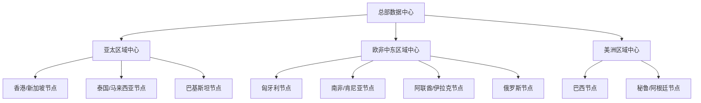

# 跨国集团网络规划方案

## 1. 网络架构总览

## 2. 核心架构设计

### 2.1 骨干网络
- 采用三层区域中心架构（总部、区域中心、本地节点）
- 主干网采用SD-WAN技术，确保灵活性和可靠性
- 关键区域部署CDN加速节点
- 各区域中心间建立全互联网络

### 2.2 数据中心布局
- 主数据中心：建议设在香港或新加坡（亚太总部）
- 区域数据中心：
  - 亚太：新加坡/香港
  - 欧非中东：匈牙利
  - 美洲：巴西

### 2.3 网络服务
- 统一通信平台（视频会议、即时通讯）
- 分布式存储系统（文件同步备份）
- 全球负载均衡
- 安全访问服务边缘（SASE）

## 3. 安全架构

### 3.1 网络安全
- 下一代防火墙（NGFW）部署
- DDoS防护
- 入侵检测/防御系统（IDS/IPS）
- 零信任网络架构（Zero Trust）

### 3.2 数据安全
- 跨区域数据加密传输
- 区域化数据存储（满足各地数据主权要求）
- 数据分级管理
- 端到端加密

## 4. 合规性设计
- 符合GDPR（欧盟）要求
- 满足PDPA（新加坡）标准
- 遵守POPI（南非）规定
- 各地区数据本地化存储

## 5. 扩展规划
- 预留北美、欧盟、日本的网络接入能力
- 采用模块化设计，支持快速部署新节点
- 预留带宽扩容空间
- 云网络混合部署能力

## 6. 高可用性设计
- 关键链路冗余
- 多运营商接入
- 业务系统双活部署
- 灾备中心建设

## 7. 监控与运维
- 全球网络监控中心
- 智能运维平台
- 统一运维管理系统
- 7x24小时技术支持

此网络规划方案考虑了业务需求、地理分布、安全合规等多个维度，采用先进的技术架构，确保高可用性和可扩展性，同时满足各地区的合规要求。后续可以根据具体预算情况进行优化调整。