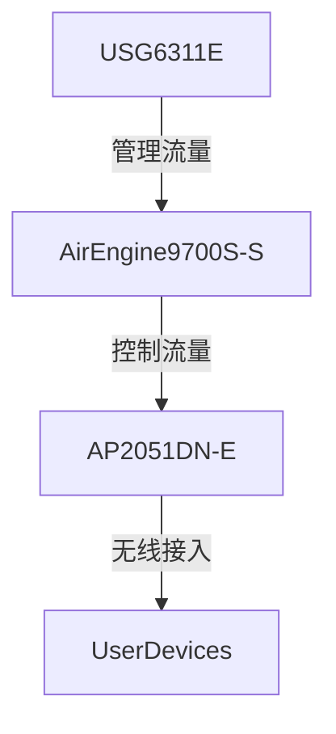

# 网络设备清单

## 1. 防火墙设备
```yaml
- model: "华为 USG6311E"
  count: 1
  location: "总部数据中心"
  purpose: "边界防火墙"
  management:
    ip: "10.1.10.1"
    vlan: "VLAN 10"
    access: "HTTPS/SSH"
  specifications:
    - 吞吐量: 20Gbps
    - 并发连接数: 200万
    - VPN性能: 2Gbps
  maintenance: "2025-12-31"
```

## 2. 无线网络设备
### 2.1 无线控制器
```yaml
- model: "华为 AirEngine 9700S-S"
  count: 1
  location: "总部数据中心"
  purpose: "无线网络控制"
  management:
    ip: "10.1.10.2"
    vlan: "VLAN 10"
  specifications:
    - 最大AP管理数: 1024
    - 最大用户数: 40K
    - 交换容量: 480Gbps
  maintenance: "2025-12-31"
```

### 2.2 无线接入点
```yaml
- model: "华为 AirEngine 2051DN-E"
  count: 50
  location: "会议室/公共区域"
  purpose: "高密度无线覆盖"
  specifications:
    - 协议标准: 802.11ax (Wi-Fi 6)
    - 双频并发
    - 最大速率: 1.775Gbps
    - PoE供电: 802.3at
  configuration:
    - management_vlan: 10
    - operation_mode: "Fit模式"
    - radio_settings:
        2.4GHz:
          channel: auto
          tx_power: 20dBm
        5GHz:
          channel: auto
          tx_power: 23dBm
  maintenance: "2025-12-31"
```

## 3. 设备拓扑关系


## 4. 维护信息
- **联系人**: 网络运维团队
- **维护窗口**: 每周四 00:00-02:00
- **备件库存**:
  - USG6311E备件: 1台
  - AP2051DN-E备件: 5台
- **文档版本**: 1.0
- **最后更新**: 2023-12-20
