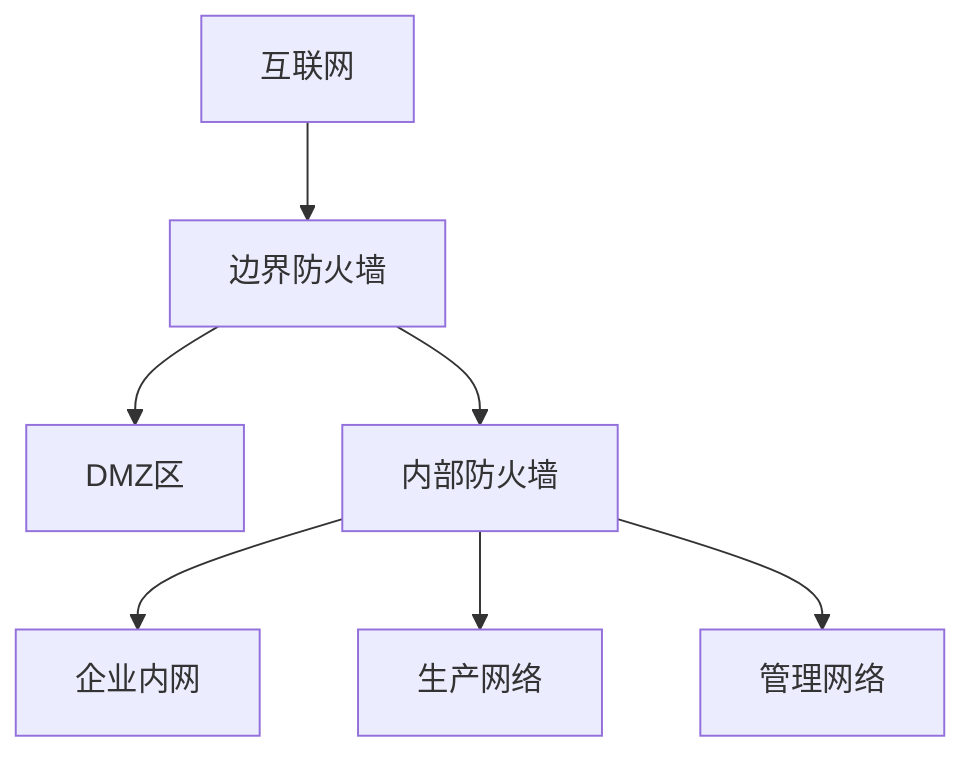

# 防火墙配置指南

## 1. 防火墙部署架构

### 1.1 网络区域划分


### 1.2 安全区域定义
- **互联网区域**：Trust Level 0
- **DMZ区域**：Trust Level 1
- **企业内网**：Trust Level 2
- **生产网络**：Trust Level 3
- **管理网络**：Trust Level 4

## 2. 边界防火墙配置

### 2.1 基础配置
```bash
# 系统配置
hostname EDGE-FW-01
system-time ntp server 10.0.0.2

# 接口配置
interface GigabitEthernet0/0
 description WAN
 ip address dhcp
 service-policy input WAN-IN
 service-policy output WAN-OUT

interface GigabitEthernet0/1
 description DMZ
 ip address 172.16.1.1 255.255.255.0
 service-policy input DMZ-IN
 service-policy output DMZ-OUT

interface GigabitEthernet0/2
 description INTERNAL
 ip address 10.0.0.1 255.255.255.0
 service-policy input INT-IN
 service-policy output INT-OUT
```

### 2.2 安全策略
```yaml
# 基础安全策略
security-policy:
  # 外网到DMZ
  internet-to-dmz:
    permit:
      - service: HTTPS
        dst-port: 443
      - service: HTTP
        dst-port: 80
      - service: DNS
        dst-port: 53
    deny: default

  # DMZ到内网
  dmz-to-internal:
    permit:
      - service: DB
        dst-port: 1521
        src-ip: 172.16.1.0/24
        dst-ip: 10.0.2.0/24
    deny: default

  # 内网到外网
  internal-to-internet:
    permit:
      - service: HTTPS
        dst-port: 443
      - service: HTTP
        dst-port: 80
      - service: DNS
        dst-port: 53
    deny: default
```

### 2.3 NAT配置
```bash
# 源NAT配置
nat source-pool INTERNET-OUT
 address-range 203.0.113.1 203.0.113.10

# DMZ服务器NAT
nat server WEB-SERVER
 protocol tcp
 global-address 203.0.113.100
 global-port 443
 inside-address 172.16.1.10
 inside-port 443
```

## 3. 内部防火墙配置

### 3.1 基础配置
```bash
# 系统配置
hostname INTERNAL-FW-01
system-time ntp server 10.0.0.2

# VLAN接口配置
interface Vlan10
 description CORP
 ip address 10.1.0.1 255.255.255.0

interface Vlan20
 description PROD
 ip address 10.2.0.1 255.255.255.0

interface Vlan30
 description MGT
 ip address 10.3.0.1 255.255.255.0
```

### 3.2 安全策略
```yaml
# 内部安全策略
security-policy:
  # 企业内网访问策略
  corp-access:
    permit:
      - service: ALL
        dst: INTERNET
      - service: DB
        dst: PROD
        ports: [1521, 3306]
      - service: ADMIN
        dst: MGT
        ports: [22, 3389]
    deny: default

  # 生产网络访问策略
  prod-access:
    permit:
      - service: BACKUP
        dst: CORP
        ports: [445]
      - service: MONITOR
        dst: MGT
        ports: [161, 162]
    deny: default

  # 管理网络访问策略
  mgt-access:
    permit:
      - service: ADMIN
        dst: ALL
        ports: [22, 3389]
    deny: default
```

## 4. 高级特性配置

### 4.1 入侵防御配置
```yaml
# IPS策略配置
ips-policy:
  signature-set: enterprise
  custom-signatures:
    - name: SQL-INJECTION
      pattern: "(?i)(select|union|insert|update|delete).*from"
      action: block
    - name: XSS-ATTACK
      pattern: "<script.*>.*</script>"
      action: block
  
  action-settings:
    high: block
    medium: alert
    low: log
```

### 4.2 应用控制
```yaml
# 应用控制策略
application-control:
  block:
    - category: P2P
    - category: GAMING
    - category: PROXY
  allow:
    - category: BUSINESS
    - category: COLLABORATION
  monitor:
    - category: SOCIAL-MEDIA
    - category: STREAMING
```

### 4.3 URL过滤
```yaml
# URL过滤策略
url-filtering:
  block:
    - category: ADULT
    - category: GAMBLING
    - category: MALWARE
  warn:
    - category: SOCIAL-NETWORKS
    - category: STREAMING-MEDIA
  allow:
    - category: BUSINESS
    - category: NEWS
```

## 5. 监控和日志

### 5.1 Syslog配置
```bash
# 系统日志配置
logging server 10.3.0.10
logging facility local7
logging level informational
logging timestamp milliseconds
```

### 5.2 SNMP配置
```bash
# SNMP监控配置
snmp-server community public RO
snmp-server host 10.3.0.11 version 2c public
snmp-server enable traps
```

### 5.3 NetFlow配置
```bash
# NetFlow配置
flow-export version 9
flow-export destination 10.3.0.12 2055
interface GigabitEthernet0/0
 flow-export enable
```

## 6. 高可用性配置

### 6.1 双机热备配置
```bash
# VRRP配置
vrrp group 1
 virtual-ip 10.0.0.1
 priority 100
 preempt
 track interface GigabitEthernet0/0 reduce 30

# 配置同步
sync-config peer 10.3.0.2
```

### 6.2 会话同步
```bash
# 会话同步配置
session-sync enable
session-sync interface GigabitEthernet0/3
session-sync key encrypted P@ssw0rd
```

## 7. 维护操作指南

### 7.1 日常检查
```bash
# 查看系统状态
show system status
show cpu usage
show memory usage

# 查看接口状态
show interface brief
show ip interface brief

# 查看安全策略
show security-policy
show nat statistics

# 查看会话信息
show session table
show session statistics
```

### 7.2 故障排查
```bash
# 连接测试
ping
traceroute
show tech-support

# 日志查看
show log
show debugging

# 策略测试
show security-policy hit-count
show flow-trace
```

## 8. 变更管理

### 8.1 配置备份
```bash
# 备份当前配置
backup configuration
save configuration

# 查看配置差异
show configuration differences
show running-config
```

### 8.2 升级建议
1. 在维护窗口执行
2. 提前备份配置
3. 准备回退方案
4. 验证新配置

## 9. 安全建议

### 9.1 基本原则
1. 最小权限原则
2. 默认拒绝策略
3. 定期审计规则
4. 及时更新签名

### 9.2 优化建议
1. 定期清理过期规则
2. 优化策略顺序
3. 监控性能指标
4. 记录策略变更